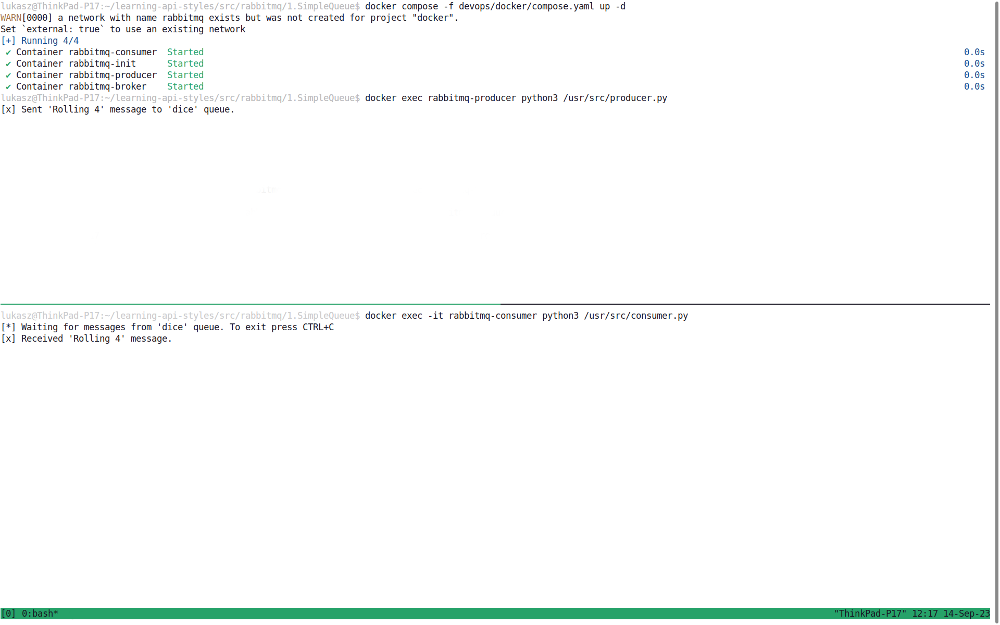

# Instructions

1. You need three terminals. I'm using [tmux](https://github.com/tmux/tmux/wiki) to split the terminal into separate windows.
1. In **first** window run `docker compose -f devops/docker/compose.yaml up -d`
1. In **second** window run `docker exec -it rabbitmq-consumer python3 /usr/src/consumer.py`
1. In **first** window run `for i in {1..6}; do docker exec rabbitmq-producer python3 /usr/src/producer.py; done`
1. In **first** `docker compose -f devops/docker/compose.yaml down --volumes`

To access RabbitMQ management console go to [localhost:15672](http://localhost:15672/) and use following credentials:
- Username: `bugs`
- Password: `bunny`

# Terminal



# Debug

```shell
docker exec rabbitmq-broker rabbitmqctl list_queues
docker exec rabbitmq-broker rabbitmqctl list_bindings
docker exec rabbitmq-broker rabbitmqctl list_exchanges
```
